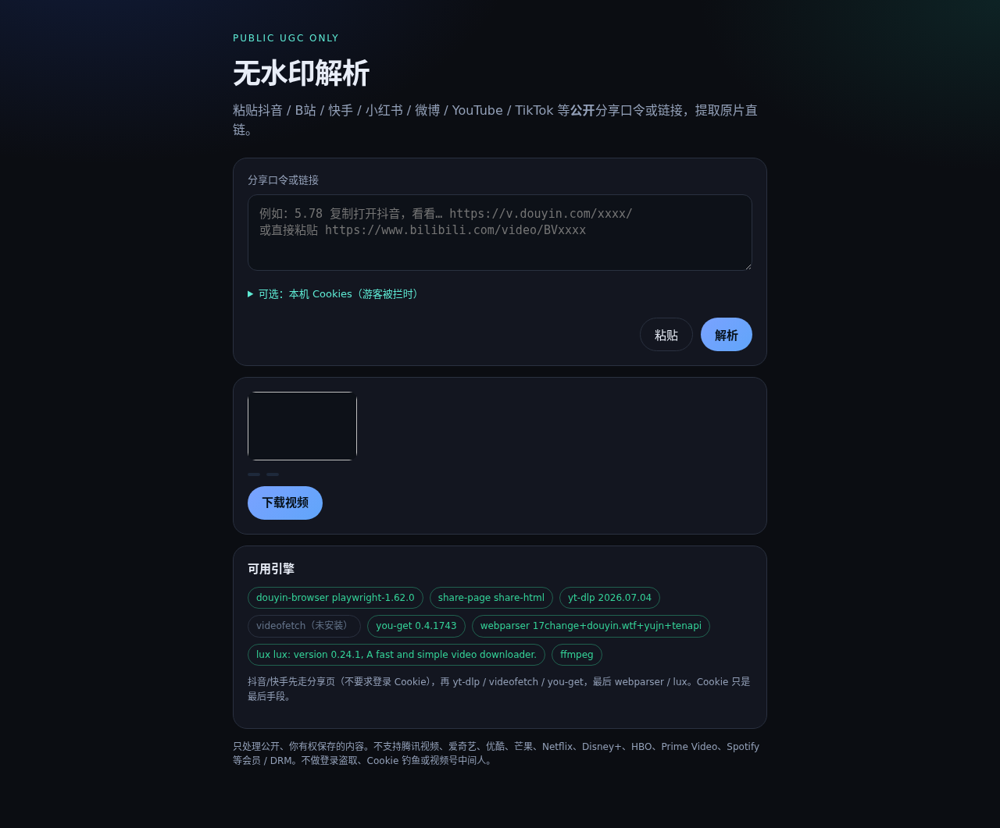

# video-unwatermark

Cole um texto de compartilhamento ou URL de vídeo **público**. O servidor faz vários extratores competirem em paralelo e devolve um link direto (de preferência sem marca d’água) para baixar o arquivo original.

<p align="center">
  <a href="../../README.md">EN</a> ·
  <a href="../zh-CN/README.md">zh-CN</a> ·
  <a href="../ja/README.md">ja</a> ·
  <a href="../ko/README.md">ko</a> ·
  <a href="../es/README.md">es</a> ·
  <a href="../fr/README.md">fr</a> ·
  <a href="../de/README.md">de</a> ·
  <a href="../pt-BR/README.md">pt-BR</a> ·
  <a href="../ru/README.md">ru</a> ·
  <a href="../ar/README.md">ar</a>
</p>

[](../../LICENSE)
[](https://www.python.org/)
[](https://fastapi.tiangolo.com/)

**Apenas UGC público.** Plataformas de assinatura / DRM (Tencent Video, iQIYI, Youku, Mango TV, Netflix, Disney+, HBO, Prime Video, Spotify, Hulu e similares) são recusadas antes de qualquer extrator. Este projeto não rouba logins, não faz phishing de cookies nem MITM de WeChat Channels.

## Recursos

- UI web em `http://127.0.0.1:8787` — colar texto/URL, pré-visualizar, baixar
- Corrida multi-engine: o primeiro sucesso vence; os demais são cancelados
- Engines: `share-page`, `douyin-browser` (Chrome headless), `yt-dlp`, `videofetch`, `you-get`, `webparser`, `lux`
- Extrai a primeira URL `http(s)` de slogans de compartilhamento
- Cookies Netscape locais / `--cookies-from-browser` opcionais como **último recurso** (nunca obtidos por você)
- Lista explícita de bloqueio VIP / DRM; recusa de captura login/MITM de WeChat Channels
- API JSON: parse, download, health, engines; OpenAPI em `/api/docs`

## Início rápido

```bash
cd video-unwatermark
chmod +x start.sh
./start.sh
```

Abra **http://127.0.0.1:8787**.

Instalação manual:

```bash
python3 -m venv .venv
source .venv/bin/activate
pip install -r requirements.txt
# optional: pip install videofetch you-get
python -m uvicorn app.main:app --host 0.0.0.0 --port 8787
```

`ffmpeg` deve estar no `PATH` (yt-dlp mescla áudio/vídeo). No Debian/Ubuntu:

```bash
sudo apt-get install ffmpeg
```

`start.sh` também tenta instalar engines opcionais (`videofetch`, `you-get`, Playwright) e baixa o `lux` Linux amd64 em `bin/` se faltar.

## Captura de tela



## API

| Method | Path | Description |
|---|---|---|
| `POST` | `/api/parse` | Body `{"url":"..."}` or multipart (`url`, optional `cookies_file`, `cookies_from_browser`) |
| `GET` | `/api/download?job=...` | Attachment download for a parse job |
| `GET` | `/api/preview?job=...` | Stream preview for a job |
| `GET` | `/api/health` | Engine + ffmpeg status; cookie flags only say *configured*, never contents |
| `GET` | `/api/engines` | Engine list |
| `GET` | `/api/docs` | OpenAPI UI |

O payload de sucesso inclui `ok`, `title`, `ext`, `filesize`, `thumbnail`, `extractor`, `platform`, `download_url`, `direct_url`, `preview_url`, `job`. Bloqueios de visitante podem retornar `{ok:false, needs_cookie:true, hint:"..."}`.

Timeouts: ~25 s por engine, ~30 s no total; Douyin/Kuaishou primeiro competem share-page + webparser + lux + `douyin-browser` (~25 s), até ~95 s no total.

## Sites suportados e limites

| Engine | Typical sites | Notes |
|---|---|---|
| **share-page** | Douyin, Kuaishou | Guest share-page HTML (`_ROUTER_DATA` / `__APOLLO_STATE__`); no login cookie |
| **douyin-browser** | Douyin | Headless Chrome; captures CDN `video_mp4` from `iesdouyin.com/share/video/{id}/` |
| **yt-dlp** | YouTube, Bilibili, TikTok, Instagram, X, Facebook, Reddit, Weibo, Vimeo, … | Follow [yt-dlp supported sites](https://github.com/yt-dlp/yt-dlp/blob/master/supportedsites.md) |
| **videofetch** | Douyin, Kuaishou, Xiaohongshu, Bilibili, … | Public-UGC clients only; VIP movie clients disabled |
| **you-get** | Some CN / social sites | Extra fallback parser |
| **webparser** | Douyin, Kuaishou | Keyless public JSON helpers (e.g. 17change, douyin.wtf hybrid) |
| **lux** | Douyin, Kuaishou | Local `bin/lux` binary; fallback only |

As APIs das plataformas mudam com frequência; falhas são normais. Conteúdo atrás de login pode retornar `needs_cookie`.

**Limitações conhecidas (honestas):**

- **Douyin**: datacenter IPs often lack `play_addr` on share pages; yt-dlp may report `needs cookie`. Public hybrid parsers or `douyin-browser` may still succeed. Cookies are never stolen.
- **Kuaishou**: yt-dlp has no Kuaishou extractor. Existing `www.kuaishou.com/short-video/{id}` pages may parse via webparser; `v.kuaishou.com` shorts often expire; TLS EOF from some hosts is common.
- **Vimeo**: anonymous macos OAuth currently returns 401; use local `--cookies-from-browser` if you are logged in.
- **YouTube**: some IPs hit a bot wall (`Sign in to confirm you’re not a bot`); same optional local cookies apply.

Notas de teste: [../test-results.md](../test-results.md)

## Cookies opcionais (último recurso)

Alguns sites (especialmente Douyin / muro de bots do YouTube) bloqueiam IPs de datacenter. Esta ferramenta **não** obtém cookies por você. **Não** cole cookies no chat.

Na **sua máquina**, forneça **seus** cookies Netscape:

1. **CLI**

```bash
./start.sh --cookies /path/to/cookies.txt
./start.sh --cookies-from-browser chrome
```

   `cookies_from_browser` só lê navegadores instalados **nessa** máquina. Em VPS remoto sem o seu perfil não funciona.

2. **Variáveis de ambiente**

```bash
export UNWATERMARK_COOKIES=/path/to/cookies.txt
export UNWATERMARK_COOKIES_FROM_BROWSER=chrome   # optional, local only
./start.sh
```

3. **Web / API** — expanda “Local Cookies”, envie Netscape `cookies.txt` ou escolha `cookies_from_browser`. Exportações JSON são rejeitadas.

Arquivos enviados só valem para aquele parse/download; não são trocados por tickets de terceiros.

## Arquitetura

FastAPI serve `static/` e rotas JSON. `app/extract.py` expande links curtos, recusa hosts bloqueados e executa corridas em estágios. O primeiro `ok` cria um job curto; `/api/download` materializa o arquivo (merge ffmpeg se necessário). Detalhes: [../architecture.md](../architecture.md). Índice: [../README.md](../README.md).

## Contribuindo

Veja [../../CONTRIBUTING.md](../../CONTRIBUTING.md). Segurança: [../../SECURITY.md](../../SECURITY.md). Mudanças: [../../CHANGELOG.md](../../CHANGELOG.md).

## Licença

[Apache License 2.0](../../LICENSE) — Copyright 2026 652036. Engines de terceiros mantêm as próprias licenças; veja [../../NOTICE](../../NOTICE).

## Aviso legal

Baixe apenas conteúdo público que você tem o direito de guardar. Respeite os termos de cada plataforma e a lei local. Este projeto **não** oferece crack de assinatura, descriptografia DRM nem acesso não autorizado.
